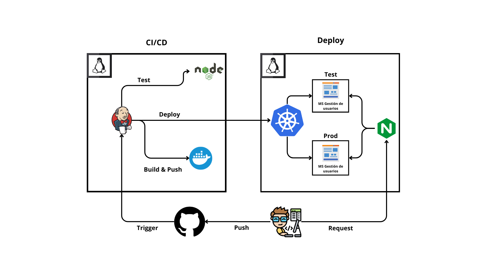

# Jenkins CI/CD deploy a Kubernetes + Nginx


Este proyecto es una implementación de CI/CD utilizando Jenkins, Docker, Kubernetes y Nginx, con el objetivo de automatizar el despliegue de una aplicación Node.js en diferentes entornos (producción y desarrollo).

## Requerimientos

- Pipeline CI/CD con Jenkins.
- Configuración de Nginx para ambientes de producción y desarrollo.
- Creación de entornos según ramas GIT.
- Creación de contenedor Docker.
- Despliegue en Kubernetes con cluster Kind.
- Exposición de servicios con port forwarding.

## Dockerfile

El `Dockerfile` crea un contenedor para la aplicación Node.js, que se encarga de instalar las dependencias necesarias, copiar el código fuente y construir la aplicación.

- Se utiliza la imagen base `node:22`.
- Instala las dependencias necesarias y reconstruye el paquete `bcrypt`.
- Crea un contenedor para la base de datos SQLite y asigna permisos.
- Expone el puerto 3000 y ejecuta la aplicación con `npm run start:prod`.


## Jenkinsfile

El `Jenkinsfile` define un pipeline para automatizar los procesos de CI/CD. Los pasos principales son:

1. **Checkout**: Clona el repositorio.
2. **Instalación de dependencias**: Se ejecuta `npm install` para instalar las dependencias.
3. **Pruebas**: Se ejecutan las pruebas unitarias.
4. **Construcción de imagen Docker**: Construye una imagen Docker para la aplicación, adaptada para producción o desarrollo según la rama.
5. **Push a Docker Hub**: Sube la imagen Docker a Docker Hub.
6. **Despliegue en Kubernetes**: Despliega la aplicación en Kubernetes usando archivos de configuración de producción o desarrollo según la rama.

## Kubernetes Manifests

### `devops-lab-dev-deployment.yaml`

Este archivo define el despliegue de la aplicación en un entorno de desarrollo utilizando Kubernetes:

- **Deployment**: Crea un despliegue de 2 réplicas de la aplicación.
- **Selector**: Se usa para asociar las réplicas con el servicio.
- **Contenedor**: Especifica la imagen `claudiopizarro/devops-lab-dev:latest` y el puerto 3000.

### `devops-lab-dev-service.yaml`

Este archivo configura un servicio para exponer la aplicación dentro del clúster:

- **Servicio tipo `NodePort`**: Expone el puerto 3000 de la aplicación en el nodo del clúster, accesible a través del puerto 32001.
- **Selector**: Asegura que el servicio se asocie correctamente con los pods del `devops-lab-dev`.

**Se aplica lo mismo para la parte de producción**


## Configuración de Nginx

Este archivo configura Nginx como un proxy inverso para redirigir el tráfico hacia los pods de Kubernetes:

```nginx
server{
        listen 80;
        server_name dev.localhost;

        location / {
                proxy_pass http://172.19.0.2:32001/;
                proxy_set_header Host $host;
                proxy_set_header X-Real-IP $remote_addr;
                proxy_set_header X-Forwarded-For $proxy_add_x_forwarded_for;
                proxy_set_header X-Forwarded-Proto $scheme;
        }
}
```
**Se aplica lo mismo para la parte de producción**
